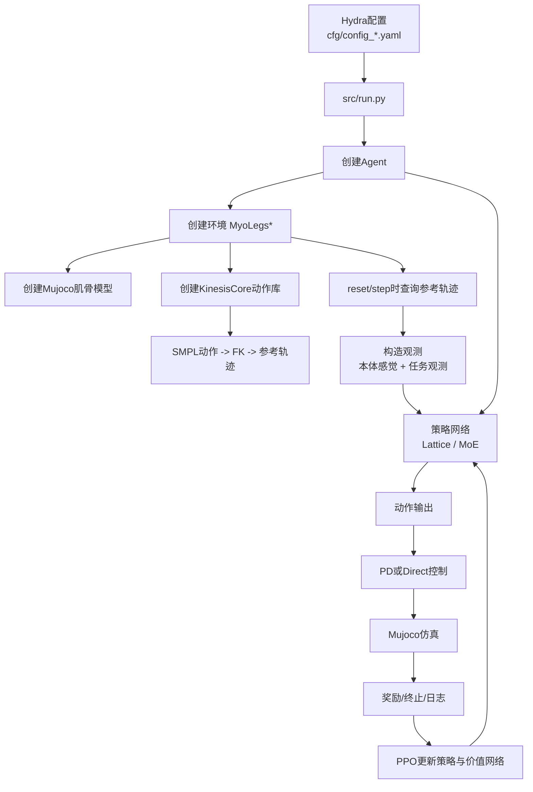
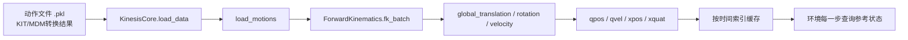
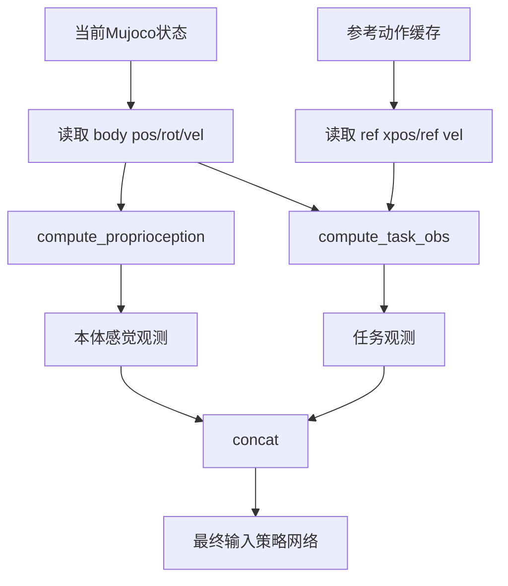
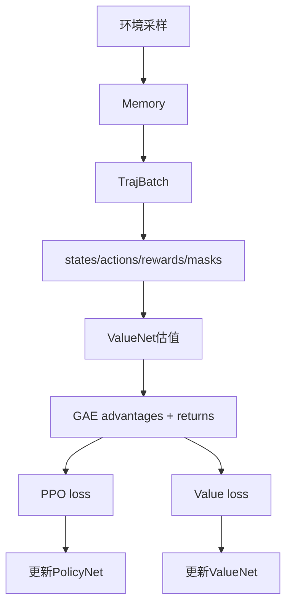
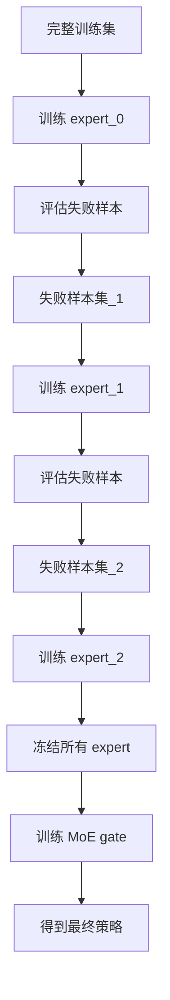
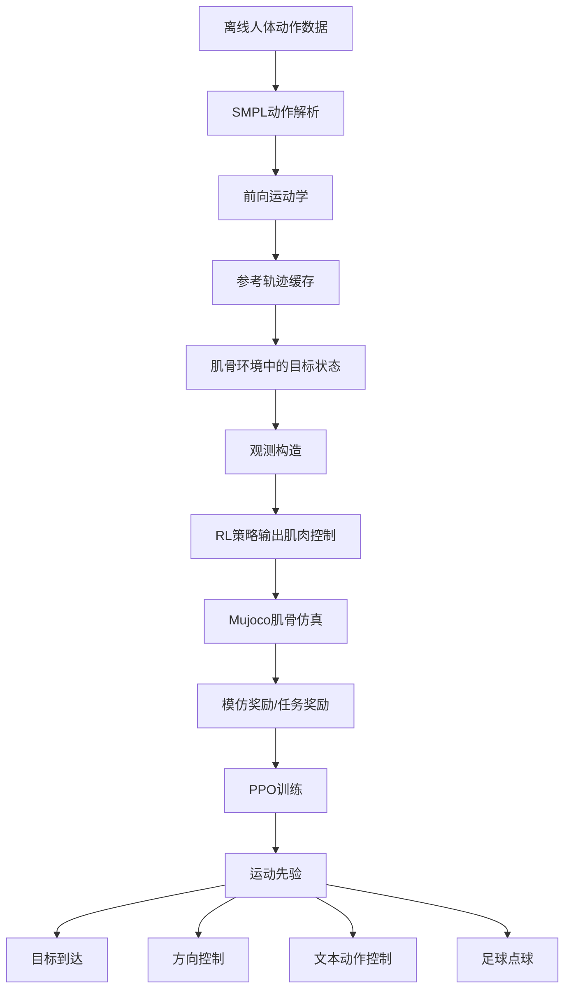

# Kinesis 项目深度学习指南

## 1. 先给项目一个总定义

Kinesis 不是一个单纯的 Mujoco 强化学习项目，而是一个把下面几层能力串起来的系统：

1. 用 `SMPL/KIT/MDM` 动作数据构建参考运动。
2. 用 `Forward Kinematics` 把参考动作变成肌骨系统可对齐的时序目标。
3. 在 `MyoSuite + Mujoco` 的肌骨仿真环境里构造观测、奖励和终止条件。
4. 用 `PPO` 训练控制策略，把“参考动作跟踪”转成“肌肉激活控制”。
5. 再把学到的运动先验迁移到高层任务，比如目标到达、方向控制、点球等。

如果只用一句话概括它的技术路线：

> Kinesis = “参考动作驱动的肌骨 imitation learning 框架”，底层学运动先验，上层复用先验做任务控制。

---

## 2. 项目技术路线总览

### 2.1 分层架构

| 层级 | 作用 | 关键目录 |
| --- | --- | --- |
| 配置层 | 用 Hydra 组合实验配置、任务配置、训练配置 | `cfg/` |
| 入口层 | 启动训练、测试、评估，实例化 Agent | `src/run.py` |
| Agent 层 | 串起环境、策略、价值网络、采样和 PPO 更新 | `src/agents/` |
| 学习层 | 策略网络、价值网络、分布、经验缓存、优势估计 | `src/learning/` |
| 环境层 | 肌骨 Mujoco 环境、模仿任务、高层任务 | `src/env/` |
| 运动核心层 | 载入动作库、前向运动学、时间索引与缓存 | `src/KinesisCore/` |
| 数据/资产层 | XML 肌骨模型、SMPL 参数、动作数据、预训练模型 | `data/`, `assets/` |

### 2.2 一张总流程图



---

## 3. 从源码视角看主干执行链路

## 3.1 入口：`src/run.py`

项目入口非常清晰，主要做五件事：

1. 通过 Hydra 读取配置。
2. 初始化 `wandb` 日志。
3. 固定随机种子和设备。
4. 根据 `cfg.learning.agent_name` 从 `src/agents/__init__.py` 中选择 Agent。
5. 根据 `cfg.run.test` 决定走训练、评估还是纯运行。

你可以把它理解成一个总调度器，本身逻辑不复杂，复杂性都下沉到了 Agent 和 Env。

---

## 3.2 配置：`cfg/`

Kinesis 的配置是“分层拼接”的：

- `cfg/config_legs.yaml`
  - 规定默认使用哪个环境配置、学习配置、运行配置。
- `cfg/env/*.yaml`
  - 定义奖励系数、控制频率、终止阈值等。
- `cfg/learning/*.yaml`
  - 定义 Agent 类型、策略类型、PPO 超参数、网络规模。
- `cfg/run/*.yaml`
  - 定义 XML 模型、动作文件、是否测试、控制方式、任务输入等。

典型配置组合如下：

- 模仿学习主任务
  - `config_legs.yaml` + `env_im.yaml` + `im_mlp.yaml` + `train_run_legs.yaml`
- 目标到达
  - `config_legs.yaml` + `pointgoal.yaml` + `eval_run_legs.yaml`
- 方向控制
  - `config_legs.yaml` + `directional.yaml` + `eval_run_legs.yaml`
- 足球点球
  - `config_legs_back.yaml` + `ball_reach.yaml` + `ball_reach.yaml/env`

这意味着：

> 这个项目的“任务切换”更多是配置驱动，而不是改主程序。

---

## 3.3 Agent 链路：训练框架如何一层层继承

Agent 体系是本项目最值得先读懂的代码骨架。

### 继承关系

```text
Agent
└── AgentPG
    └── AgentPPO
        └── AgentHumanoid
            ├── AgentIM
            ├── AgentPointGoal
            ├── AgentDirectional
            └── AgentBallReach
```

### 各层职责

#### `Agent`

负责最底层的 RL 采样基础设施：

- 多进程采样
- 经验缓存 `Memory`
- 轨迹打包 `TrajBatch`
- 动作预处理
- 观测裁剪
- worker 级日志与容错

这一层解决的是“如何稳定地从环境里采样数据”。

#### `AgentPG`

负责经典 policy gradient 训练流程：

- 计算 value
- 用 `estimate_advantages` 计算 GAE
- 更新策略与价值网络

这一层解决的是“如何把采样轨迹变成梯度更新”。

#### `AgentPPO`

在 `AgentPG` 上替换成 PPO 更新：

- 计算旧策略 `fixed_log_probs`
- 构造 PPO ratio
- clip surrogate objective
- 梯度裁剪

这一层解决的是“如何稳定更新策略”。

#### `AgentHumanoid`

开始进入项目语义层：

- 创建环境
- 创建策略网络和价值网络
- 创建优化器
- 加载/保存 checkpoint
- 训练总循环 `optimize_policy`

这一层相当于“把通用 PPO 框架接到 humanoid/musculoskeletal 项目上”。

#### `AgentIM` 及其子类

进一步绑定具体任务：

- `AgentIM` -> 模仿学习
- `AgentPointGoal` -> 目标点到达
- `AgentDirectional` -> 方向控制
- `AgentBallReach` -> 足球/踢球任务

---

## 4. 环境链路：环境并不是一个类，而是一条继承树

### 4.1 环境继承关系

```text
BaseEnv
└── MyoLegsEnv
    └── MyoLegsTask
        ├── MyoLegsIm
        │   ├── MyoLegsPointGoal
        │   │   └── MyoLegsDirectional
        │   └── MyoLegsBallReach（部分逻辑直接走 MyoLegsEnv）
```

### 4.2 每层环境在做什么

#### `BaseEnv`

提供 Gymnasium 风格的统一接口：

- `reset`
- `step`
- `render`
- `create_sim`

它更像“最薄的一层壳”。

#### `MyoLegsEnv`

这是底层肌骨环境核心：

- 载入 Mujoco XML
- 定义 observation space / action space
- 组织本体感觉观测
- 把策略动作转成肌肉控制
- 调 `mujoco.mj_step` 推进仿真

关键思想是：

> 策略输出不是关节力矩，而是肌肉控制相关量。

控制模式有两种：

- `PD`
  - 动作先映射成目标肌腱长度，再转成肌肉激活。
- `direct`
  - 直接把 `[-1, 1]` 动作映射到 `[0, 1]` 激活。

#### `MyoLegsTask`

在底层环境之上增加“任务观测”接口：

- `compute_task_obs`
- `reset_task`
- `draw_task`

于是整个观测 = 本体感觉 + 任务观测。

#### `MyoLegsIm`

这是项目最核心的任务环境。它做了四件大事：

1. 载入参考动作库 `KinesisCore`
2. reset 时设置与参考动作对齐的初始姿态
3. 每一步生成 imitation task observation
4. 用参考动作和当前动作的差异来计算 reward 与 reset

---

## 5. 动作数据是如何变成“可模仿目标”的

## 5.1 KinesisCore 的职责

`src/KinesisCore/kinesis_core.py` 是项目的“运动参考核心”。

它的工作流是：

1. 读取 `joblib/pkl` 动作文件。
2. 取出 `pose_aa`、`trans`、`fps` 等字段。
3. 调 `ForwardKinematics` 把 SMPL 动作变成：
   - 全局关节位置 `xpos`
   - 全局关节旋转 `xquat`
   - body velocity
   - qpos / qvel
4. 按时间索引提供 `get_motion_state_intervaled(...)` 接口给环境查询。

### 5.2 这一层为什么重要

因为 Mujoco 肌骨体和 SMPL 动作并不是天然同构的。  
KinesisCore 做的就是：

> 把“离线人体动作数据”翻译成“在线环境每一时刻都能查询的参考目标”。

### 5.3 参考运动生成流程图



---

## 6. 观测是怎么构造出来的

项目里的观测不是一个平铺数组那么简单，而是有明确语义分层。

## 6.1 本体感觉观测：`MyoLegsEnv.compute_proprioception`

可选输入由 `cfg.run.proprioceptive_inputs` 决定，常见包括：

- `root_height`
- `root_tilt`
- `local_body_pos`
- `local_body_rot`
- `local_body_vel`
- `local_body_ang_vel`
- `feet_contacts`
- `muscle_len / muscle_vel / muscle_force`
- `muscle_fatigue`（开启疲劳建模时）

这些观测描述的是“身体当前处于什么状态”。

## 6.2 任务观测：`MyoLegsIm.compute_task_obs`

模仿学习场景下，任务观测来自当前姿态与参考姿态的差异：

- `diff_local_body_pos`
- `diff_local_vel`
- `local_ref_body_pos`

这些观测回答的是：

- 我现在和参考动作差了多少？
- 参考目标在我局部坐标系下在哪里？

## 6.3 一步内的观测构造流程



---

## 7. 奖励与终止：项目真正的“学习目标”

## 7.1 模仿学习奖励

`MyoLegsIm.compute_reward` 由三部分组成：

1. **imitation reward**
   - 来自 `compute_imitation_reward`
   - 对齐身体位置和线速度
2. **upright reward**
   - 鼓励保持直立
3. **energy reward**
   - 惩罚高能耗控制

公式上可以理解为：

```text
reward = 模仿奖励 + 直立奖励 + 能耗奖励
```

其中模仿奖励又分成：

- `r_body_pos`
- `r_vel`

它们本质上都是“当前状态与参考状态的误差越小，reward 越高”。

## 7.2 reset 条件

核心逻辑是：

- 如果和参考轨迹偏差超过 `termination_distance`，则提前失败
- 如果走完整段参考动作，则算成功完成

因此，策略学习的实质不是“短期站稳”而是：

> 在肌骨动力学约束下，把整段参考动作尽量连续地跟下来。

---

## 8. 策略网络为什么有 `lattice` 和 `moe`

## 8.1 `PolicyLattice`

这是单专家策略，适合直接训练一个连续动作策略：

- 主干是 MLP
- 输出动作均值
- 再构造带相关性的多元高斯分布

它可以看成：

> 一个更强的连续动作策略基线，用来训练单个 expert。

## 8.2 `PolicyMOE`

这是 Kinesis 的重要设计点。

MoE 不直接生成连续动作，而是：

1. 用 gate 网络根据状态选择 expert。
2. expert 本身输出动作。
3. MoE 阶段通常冻结 expert，只训练 gate。

这样做的动机很明确：

- locomotion 动作模式具有多样性
- 单一策略很难覆盖所有失败模式
- 先分批训练 expert，再组合，鲁棒性更高

## 8.3 `PolicyMOEWithPrev`

这是带“前一个 expert index”条件输入的版本。  
也就是 gate 不只看当前状态，还看上一步选了哪个 expert，用来增加时序连续性。

---

## 9. 训练流程：项目最关键的一条主线

## 9.1 标准训练循环

`AgentHumanoid.optimize_policy()` 的主循环非常标准：

1. `pre_epoch()`
2. `sample(...)`
3. `update_params(batch)`
4. 保存 checkpoint
5. 记录日志

但真正要理解的是采样和更新内部发生了什么。

## 9.2 采样流程

采样发生在 `Agent.sample()` / `sample_worker()`：

1. 环境 `reset`
2. 得到观测
3. 策略选择动作
4. 环境 step
5. 存入 `Memory`
6. 重复直到收集到 `min_batch_size`

多线程版本里，多个进程并行跑 environment rollout，最后汇总成 `TrajBatch`。

## 9.3 PPO 更新流程

`AgentPG.update_params()` 负责：

1. 把 batch 转成 tensor
2. 用 value net 估计 state value
3. 用 `estimate_advantages` 计算 GAE
4. 调 `AgentPPO.update_policy()`

`AgentPPO.update_policy()` 再完成：

1. 计算旧策略 log prob
2. 计算 ratio
3. clip PPO surrogate
4. 更新 policy / value

### PPO 数据流图



---

## 10. Kinesis 的关键方法论：Negative Mining + Mixture of Experts

README 已经给出了训练范式，但这里可以再从“为什么”讲清楚。

### 10.1 Negative Mining 的逻辑

第一阶段不是直接训练 MoE，而是先训练单个 expert。

流程如下：

1. 训练 expert_0
2. 在训练集上跑一遍
3. 找出 expert_0 模仿失败的 motion
4. 把失败样本重新组成数据集
5. 用这个更难的数据集训练 expert_1
6. 继续迭代，得到 expert_2 ...

它的本质是：

> 用“失败样本递进重采样”让不同 expert 覆盖不同难例分布。

### 10.2 MoE 阶段

当多个 expert 都训练好之后：

- 冻结 expert 参数
- 加载 expert 权重
- 训练 gate 网络来选择 expert

### 10.3 训练范式流程图



这是项目最有研究味道、也最值得深学的设计之一。

---

## 11. 下游任务是如何复用运动先验的

Kinesis 的高层任务不是推倒重来，而是在模仿学习骨架上做“任务改写”。

## 11.1 Target Reaching

`MyoLegsPointGoal` 的做法：

- 不再读取整段参考动作
- 把参考目标改成“当前位置到目标点的局部几何关系”
- 奖励改成“向目标前进 + 低能耗 + 直立”

相当于把 imitation task observation 的语义从“跟踪参考动作”换成“跟踪目标点”。

## 11.2 Directional Control

`MyoLegsDirectional` 基本继承 `PointGoal`：

- 目标点不是随机采样
- 而是根据按键方向动态更新

因此它本质是一个“在线设置目标方向的 point-goal 控制器”。

## 11.3 Ball Reach / Penalty Kick

`MyoLegsBallReach` 再进一步：

- 目标不再是静态点，而是足球场景中的球和球门
- 增加守门员逻辑
- 奖励引入 ball velocity / tracking / upright 等因素

这说明项目有一个非常明确的路线：

> 先学通用 locomotion prior，再把 prior 迁移到更复杂的具身任务。

---

## 12. 疲劳建模在项目中的位置

`src/fatigue/myosuite_fatigue.py` 实现了 3CC-r 风格的累积疲劳模型。

当你设置：

```bash
run.muscle_condition=fatigue
```

环境会在控制链路中做这件事：

1. 策略输出期望肌肉活动
2. 疲劳模型根据 `MA/MR/MF` 状态修正实际可输出的激活
3. 环境再把修正后的激活送进 Mujoco

这会让控制问题从“理想肌肉控制”变成“受生理疲劳约束的控制”。

对学习者来说，这一块很适合后面进阶时再读，不建议第一天就扎进去。

---

## 13. 推荐的源码学习顺序

如果你要真正“深度学习这个项目”，最重要的不是从头到尾机械通读，而是按依赖关系来。

### 第一阶段：先建立全局图

按这个顺序读：

1. `README.md`
2. `src/run.py`
3. `cfg/config_legs.yaml`
4. `cfg/run/train_run_legs.yaml`
5. `cfg/learning/im_mlp.yaml`

目标：

- 看懂程序怎么启动
- 看懂配置是怎么拼起来的
- 看懂默认实验到底在训什么

### 第二阶段：读训练骨架

按这个顺序读：

1. `src/agents/agent.py`
2. `src/agents/agent_pg.py`
3. `src/agents/agent_ppo.py`
4. `src/agents/agent_humanoid.py`
5. `src/agents/agent_im.py`

目标：

- 看懂采样、缓存、GAE、PPO 更新
- 看懂策略网络和环境是什么时候创建的
- 看懂训练循环和 checkpoint 机制

### 第三阶段：读环境与奖励

按这个顺序读：

1. `src/env/myolegs_base_env.py`
2. `src/env/myolegs_env.py`
3. `src/env/myolegs_task.py`
4. `src/env/myolegs_im.py`

重点盯住这些函数：

- `compute_proprioception`
- `compute_task_obs`
- `compute_reward`
- `compute_reset`
- `reset_task`
- `initialize_motion_state`

目标：

- 看懂 observation 由哪些物理量组成
- 看懂 reward 在鼓励什么
- 看懂 reset 为什么会发生

### 第四阶段：读动作参考系统

按这个顺序读：

1. `src/KinesisCore/kinesis_core.py`
2. `src/KinesisCore/forward_kinematics.py`
3. `src/smpl/smpl_parser.py`

目标：

- 看懂动作数据是怎么被处理成参考状态的
- 看懂为什么环境里能“按时间查询目标轨迹”

### 第五阶段：读策略结构

按这个顺序读：

1. `src/learning/policy.py`
2. `src/learning/policy_lattice.py`
3. `src/learning/policy_moe.py`
4. `src/learning/experts.py`
5. `src/learning/critic.py`
6. `src/learning/learning_utils.py`

目标：

- 看懂单专家和 MoE 的差别
- 看懂专家冻结与 gate 训练
- 看懂 PPO 所需的 log prob / advantages 是如何对接网络的

### 第六阶段：读高层任务复用

按这个顺序读：

1. `src/env/myolegs_pointgoal.py`
2. `src/env/myolegs_directional_control.py`
3. `src/env/myolegs_ball_reach.py`

目标：

- 看懂项目如何把模仿学习骨架改造成新任务
- 学会复用这个代码框架自己加任务

---

## 14. 一条适合你的学习路径

如果你的目标是“不是只会跑，而是真能改”，建议按下面路径推进。

### 路线 A：3 天快速入门

#### 第 1 天

- 跑通一个现成脚本，比如 `scripts/kit-locomotion.sh`
- 看 `run.py + config_legs.yaml + train_run_legs.yaml`
- 画出自己的“启动链路图”

#### 第 2 天

- 读 `Agent` 和 `MyoLegsIm`
- 重点理解 observation / reward / reset
- 记录每个 step 内部依次发生了什么

#### 第 3 天

- 读 `KinesisCore` 和 `PolicyMOE`
- 弄清 negative mining + MoE 训练范式
- 尝试解释“为什么这个项目不是直接训一个大策略”

### 路线 B：1 周深入掌握

#### 第 1-2 天

- 完成路线 A

#### 第 3-4 天

- 逐行读 `myolegs_im.py`
- 把每个观测项写成表格
- 自己核对 observation dimension 的来源

#### 第 5 天

- 逐行读 `agent.py / agent_ppo.py`
- 自己画 PPO 数据流图

#### 第 6 天

- 读 `pointgoal / directional / ball_reach`
- 比较“哪些代码被复用，哪些 reward 被替换”

#### 第 7 天

- 自己尝试加一个简单任务
  - 比如固定速度行走
  - 或固定转向角追踪

### 路线 C：研究复现导向

如果你是为了论文复现或二次研究，建议把重点放在：

1. 负样本挖掘是否改变训练分布。
2. MoE gate 的选择是否具有时序一致性。
3. imitation reward 与 downstream reward 的耦合方式。
4. 肌肉疲劳模型对策略泛化的影响。
5. 不同肌骨复杂度模型（80/86/290 muscles）上的可扩展性。

---

## 15. 学习时最值得自己回答的 10 个问题

1. `run.py` 最终是如何根据配置选中具体 Agent 的？
2. 为什么环境观测要拆成本体感觉和任务观测两部分？
3. `MyoLegsIm` 每一步如何拿到“当前时刻”的参考轨迹？
4. 为什么 reward 不直接比较关节角，而是比较 body position / velocity？
5. `termination_distance` 对训练稳定性有什么影响？
6. `PD` 控制和 `direct` 控制的训练难度有什么区别？
7. `PolicyLattice` 和普通高斯策略相比，多了什么表达能力？
8. Negative mining 为什么可能比单策略全量训练更稳？
9. MoE 为什么通常只训练 gate，而冻结 expert？
10. 高层任务为什么还能复用 imitation 的一部分 observation 结构？

如果你能把这 10 个问题都用源码回答出来，基本就算真正进入这个项目了。

---

## 16. 给你的实操建议

### 最适合开始动手的三个小练习

1. 修改 `reward_specs`
   - 观察 `w_energy`、`w_upright` 变化对行为的影响。
2. 删除一个 task input
   - 比如去掉 `diff_local_vel`，看策略表现如何变化。
3. 新建一个简单任务类
   - 继承 `MyoLegsPointGoal`，把目标固定在身体正前方。

### 最适合做笔记的三个位置

1. `src/env/myolegs_im.py`
2. `src/agents/agent.py`
3. `src/KinesisCore/kinesis_core.py`

因为项目里 80% 的“为什么能跑起来”，都藏在这三处。

---

## 17. 最后一张总图：你应该怎样理解 Kinesis



---

## 18. 你接下来最推荐怎么学

如果你现在就准备开始深入，我建议你按下面顺序实际操作：

1. 先通读 `src/run.py` 和 `cfg/config_legs.yaml`。
2. 再读 `src/agents/agent_humanoid.py`，抓住训练主循环。
3. 接着集中读 `src/env/myolegs_im.py`，把 reset / obs / reward 三件事看懂。
4. 然后读 `src/KinesisCore/kinesis_core.py`，补齐参考动作来源。
5. 最后读 `src/learning/policy_lattice.py` 和 `src/learning/policy_moe.py`，理解策略设计。

按照这条线，你会先理解“系统怎么跑”，再理解“动作目标怎么来”，最后理解“策略为什么这样设计”。这样学习成本最低，也最不容易在细节里迷路。
